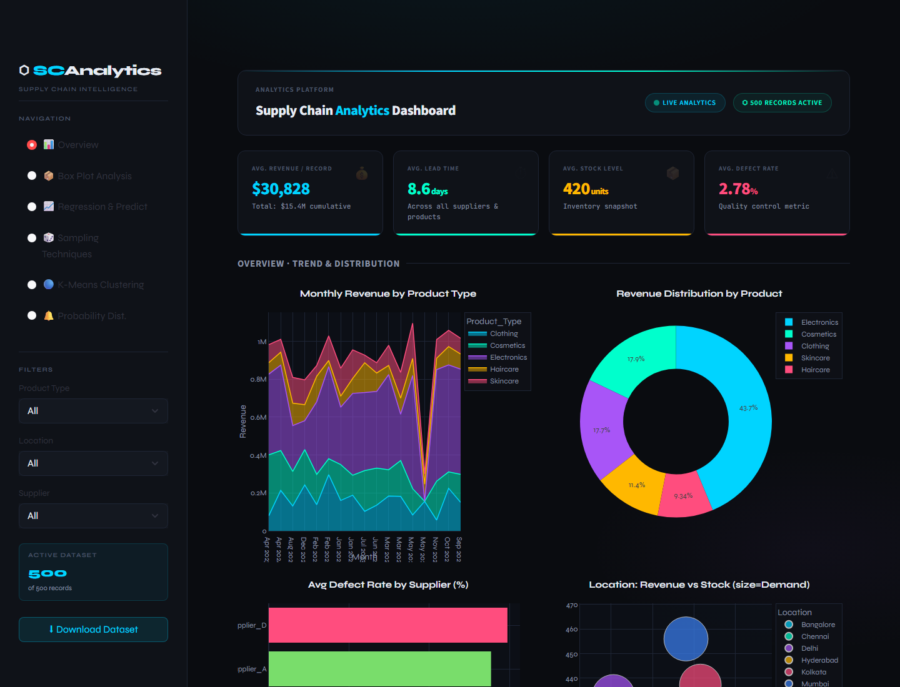
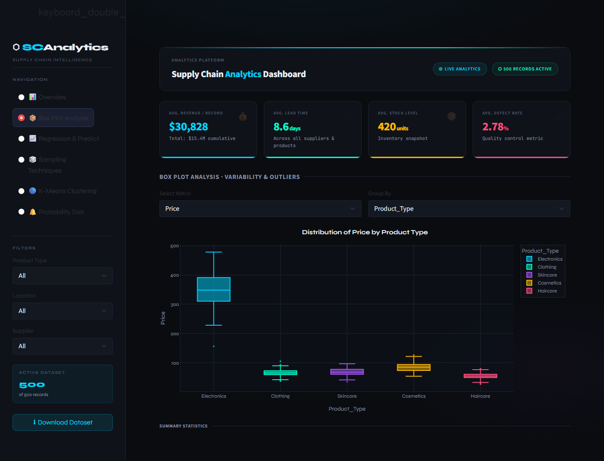
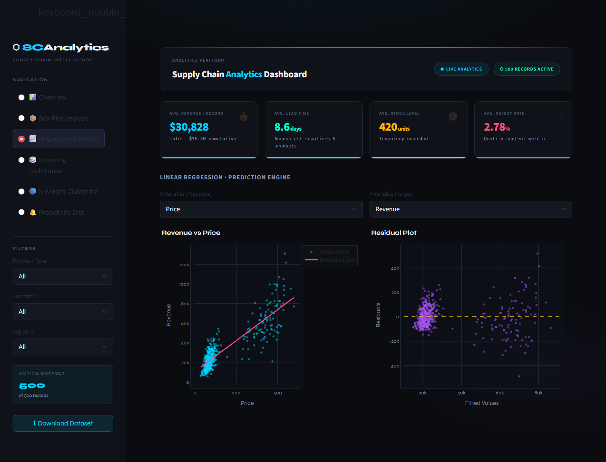
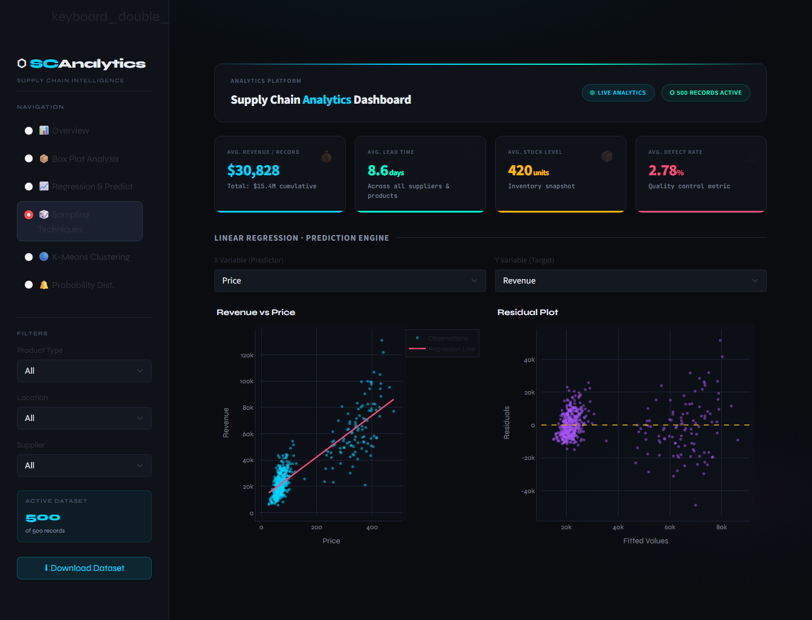
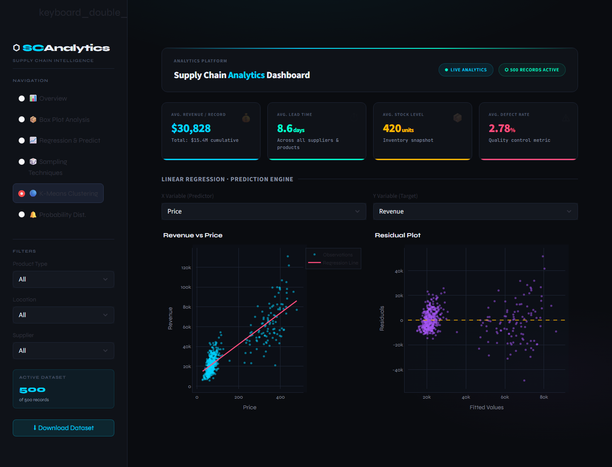
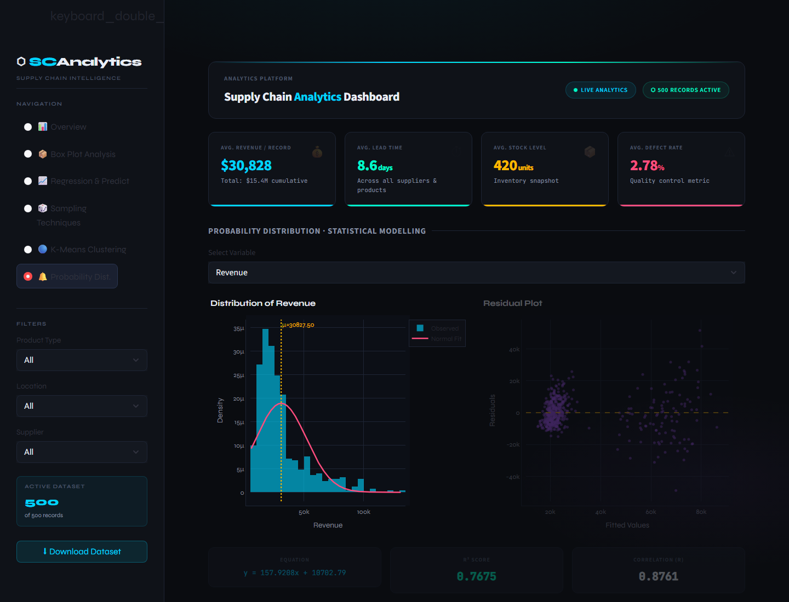

# Supply Chain Analytics Dashboard Report

## 1. Introduction

The Supply Chain Analytics Dashboard is an interactive web application developed using Streamlit. It provides a single analytical environment for studying revenue performance, supplier quality, inventory position, sampling behaviour, predictive relationships, clustering segments, and probability distributions.

The dashboard is intended to support supply chain decision making by combining visual analytics, statistical summaries, and machine learning techniques in a clean, filterable interface.

## 2. Objectives

The main objectives of the project are:

- To build a dashboard that presents supply chain performance indicators clearly.
- To provide interactive filtering by product type, location, and supplier.
- To analyze revenue trends, product contribution, supplier defects, and stock behaviour.
- To detect variability and outliers using box plot analysis.
- To apply linear regression for prediction and relationship modelling.
- To compare sampling techniques and evaluate sampling bias.
- To use K-Means clustering for operational segmentation.
- To apply probability distribution analysis for statistical interpretation.

## 3. Tools and Technologies

| Technology | Usage |
|---|---|
| Python | Core programming language |
| Streamlit | Dashboard interface |
| Pandas | Data manipulation and grouping |
| NumPy | Numerical calculations |
| Plotly | Interactive visual charts |
| Scikit-learn | Regression and clustering models |
| SciPy | Probability modelling and statistical tests |

## 4. Dataset Description

The dashboard analyses supply chain records covering product, supplier, location, demand, revenue, stock, cost, quality, and profitability attributes.

Important fields include:

- Product type
- SKU
- Location
- Supplier
- Price
- Demand
- Revenue
- Stock level
- Lead time
- Shipping cost
- Manufacturing cost
- Defect rate
- Profit margin
- Month

These fields make it possible to study both commercial performance and operational efficiency.

## 5. Dashboard Interface

The application uses a dark themed dashboard layout with a sidebar for navigation and filters. The top area displays live analytical status and KPI cards. Each section then presents charts, tables, and written insights for the selected analytical method.



## 6. Module Wise Explanation

### 6.1 Overview: Trend and Distribution

The Overview section gives a quick business summary of the supply chain. It displays average revenue per record, average lead time, average stock level, and average defect rate.

The charts in this module include:

- Monthly revenue by product type.
- Revenue distribution by product.
- Average defect rate by supplier.
- Revenue versus stock by location.

This section helps identify strong product categories, supplier quality concerns, and locations that may require inventory review.


### 6.2 Box Plot Analysis

The Box Plot Analysis section is used to inspect variability in numerical supply chain metrics. The user can select a metric and group it by product type, location, or supplier.

The section includes:

- Box plot visualization.
- Summary statistics table.
- Mean, median, standard deviation, and outlier count.
- Outlier listing using the IQR method.

This analysis is useful for detecting unusual demand, revenue, cost, lead time, or quality values.



### 6.3 Linear Regression and Prediction

The Regression and Prediction section applies simple linear regression between two selected numerical variables. It allows users to choose the predictor and target variable.

The module displays:

- Scatter plot with regression line.
- Residual plot.
- Regression equation.
- R-squared score.
- Correlation coefficient.
- Input based prediction result.

This section is useful for exploring relationships such as how price, demand, cost, or stock levels relate to revenue and other business metrics.



### 6.4 Sampling Techniques

The Sampling Techniques section compares different approaches for selecting representative records from the full dataset.

The implemented methods are:

- Simple random sampling.
- Systematic sampling.
- Stratified sampling.

The dashboard compares the distribution, mean, standard deviation, median, minimum, and maximum values across the methods. It also reports the method with the lowest mean bias for the selected metric.



### 6.5 K-Means Clustering

The K-Means Clustering section segments records into groups based on selected numerical variables. Users can choose the X axis, Y axis, and number of clusters.

The module includes:

- Cluster scatter plot.
- Centroid markers.
- Cluster size distribution.
- Cluster summary statistics.
- Elbow method chart.

This section helps identify operational groups, such as high revenue segments, high stock segments, or cost sensitive segments.



### 6.6 Probability Distribution

The Probability Distribution section studies the statistical behaviour of a selected numerical variable.

It includes:

- Histogram with normal curve.
- Empirical cumulative distribution function.
- Theoretical cumulative distribution function.
- Mean, standard deviation, skewness, and kurtosis.
- Shapiro-Wilk normality interpretation.
- Probability calculator for a selected interval.

This section helps understand whether a metric behaves approximately normally and how likely values are to fall within a selected range.



## 7. Key Performance Indicators

The dashboard highlights four important KPIs:

| KPI | Meaning |
|---|---|
| Average Revenue per Record | Indicates average commercial value across records |
| Average Lead Time | Measures supplier or fulfillment responsiveness |
| Average Stock Level | Represents inventory position |
| Average Defect Rate | Measures quality performance |

These KPIs remain visible across analytical sections, helping users keep the overall business context while exploring deeper analysis.

## 8. Analytical Value

The dashboard supports several practical supply chain decisions:

- Identifying products with strong revenue contribution.
- Detecting suppliers with higher defect rates.
- Finding inventory imbalance across locations.
- Spotting outliers in demand, revenue, costs, lead time, and defect rate.
- Estimating target variables using regression.
- Selecting suitable sampling approaches.
- Segmenting supply chain records into meaningful clusters.
- Understanding probability patterns and value ranges.

## 9. Conclusion

The Supply Chain Analytics Dashboard successfully combines descriptive analytics, statistical analysis, and machine learning in one interactive application. It provides a practical and visually clear way to study supply chain performance across products, suppliers, locations, costs, revenue, inventory, and quality indicators.

The dashboard can be extended further by connecting it to live operational systems, adding authentication, exporting reports, or introducing advanced forecasting models.

## 10. How to Run

Install dependencies:

```bash
pip install -r requirements.txt
```

Run the app:

```bash
streamlit run app.py
```

Open the displayed local URL in a browser to access the dashboard.
